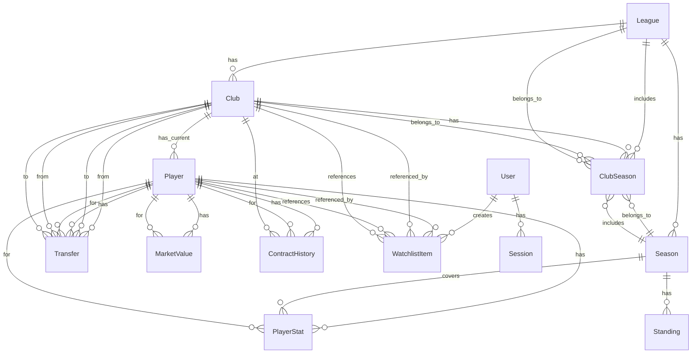

# Database Schema ER Diagram

## Entity Relationship Diagram

## Core Entities Description

### 1. League
- **Purpose**: Represents a football competition/league
- **Key Fields**: `name`, `country`, `code` (EN/ES/DE), `season`
- **Relationships**: Has many Clubs, Seasons, ClubSeasons

### 2. Season
- **Purpose**: Tracks a specific season within a league
- **Key Fields**: `leagueId`, `year` (2024-25), `startDate`, `endDate`, `isCurrent`
- **Relationships**: Belongs to League, has many Standings and ClubSeasons

### 3. Club
- **Purpose**: Football club/team information
- **Key Fields**: `name`, `founded`, `stadium`, `logo`, `leagueId`
- **Relationships**: Belongs to League, has many Players, Transfers (as from/to)

### 4. Player
- **Purpose**: Core player profile and current status
- **Key Fields**: `name`, `position`, `birthDate`, `nationality`, `currentClubId`, `marketValue`
- **Relationships**: Belongs to Club (current), has many Transfers, Stats, MarketValues

### 5. Transfer
- **Purpose**: Records player movement between clubs
- **Key Fields**: `playerId`, `fromClubId`, `toClubId`, `transferDate`, `fee`, `transferType`
- **Relationships**: Links Player and two Clubs
- **Types**: permanent transfer, loan, free transfer

### 6. PlayerStat
- **Key Fields**: `playerId`, `season`, `competition`, `appearances`, `goals`, `assists`, etc.
- **Purpose**: Season-specific performance statistics
- **Relationships**: Belongs to Player

### 7. MarketValue
- **Key Fields**: `playerId`, `date`, `value` (EUR), `source`
- **Purpose**: Historical market value tracking
- **Relationships**: Belongs to Player

### 8. ContractHistory
- **Key Fields**: `playerId`, `clubId`, `startDate`, `endDate`, `jerseyNumber`
- **Purpose**: Complete contract timeline for players
- **Relationships**: Links Player and Club

### 9. ClubSeason
- **Key Fields**: `clubId`, `leagueId`, `season`, `position`
- **Purpose**: Junction table for club performance in specific league seasons
- **Relationships**: Connects Club, League, and Season

### 10. User & Auth (optional for MVP)
- **User**: Authentication and role management
- **Session**: JWT session tracking
- **WatchlistItem**: User's saved players/clubs

## Key Design Decisions

1. **Normalization**: Schema is normalized to 3NF with junction tables where needed
2. **Temporal Data**: MarketValue and Transfer track history with dates
3. **Multi-nationality**: Players can have multiple nationalities (array)
4. **Currency**: All fees/market values stored in EUR base with currency field for clarity
5. **Flexible Stats**: PlayerStat supports multiple competitions per season
6. **Current State**: Player.currentClubId and Club.currentLeagueId allow quick lookups
7. **Historical Tracking**: ContractHistory and ClubSeason maintain complete history

## Indexes

Performance optimizations:
- `Player(name)` for search
- `Player(currentClubId)` for club roster queries
- `Transfer(playerId, transferDate)` for player transfer history
- `MarketValue(playerId, date)` with unique constraint
- `PlayerStat(playerId, season, competition)` with unique constraint

## Migrations

Initial migration plan:
1. Create all tables with relationships
2. Add foreign key constraints
3. Add indexes
4. Add unique constraints

Future migrations may add:
- Trigger for updating player market value aggregates
- Materialized view for league standings
- Full-text search vectors for player/club names