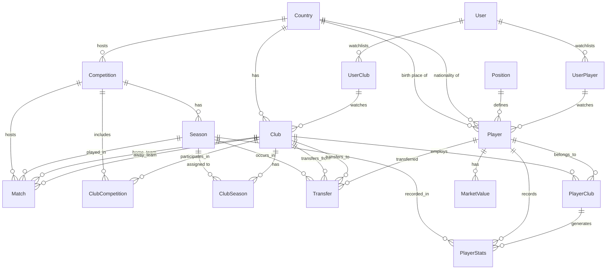

# Database Schema Documentation

## Overview

This document defines the database schema for the Transfermarkt clone - a comprehensive football/soccer transfer database and statistics platform. The schema is implemented using Prisma ORM with PostgreSQL.

## ER Diagram



## Entity Descriptions

### Core Entities

#### Country
Represents a country/nation.
- `id`: Primary key
- `name`: Country name (unique)
- `code`: ISO country code (optional)
- `flagUrl`: URL to country flag image

#### Competition
A football competition (league, cup, etc.).
- `id`: Primary key
- `name`: Competition name (e.g., "Premier League", "UEFA Champions League")
- `type`: Enum (LEAGUE, CUP, CHAMPIONS_LEAGUE, EUROPA_LEAGUE, etc.)
- `countryId`: Foreign key to Country (optional for international competitions)
- `externalId`: ID from external data sources (optional, unique)
- `logoUrl`: URL to competition logo

#### Season
Represents a sports season with start and end dates.
- `id`: Primary key
- `year`: Season year string (e.g., "2024/2025")
- `startDate`: Season start date
- `endDate`: Season end date
- `isCurrent`: Boolean flag for current active season

#### Club
A football club/team.
- `id`: Primary key
- `name`: Full club name
- `shortName`: Short club name (optional)
- `slug`: URL-friendly unique identifier
- `foundedYear`: Year club was founded
- `stadiumName`: Home stadium name
- `stadiumCapacity`: Stadium seating capacity
- `website`: Official website URL
- `logoUrl`: Club logo URL
- `countryId`: Country where club is based
- `externalId`: External data source ID (optional, unique)

#### Player
A football player.
- `id`: Primary key
- `firstName`: Player's first name
- `lastName`: Player's last name
- `fullName`: Full name (computed)
- `slug`: URL-friendly unique identifier
- `birthDate`: Date of birth
- `birthPlaceId`: Country of birth (optional)
- `nationalityId`: Nationality country
- `height`: Height in cm (optional)
- `weight`: Weight in kg (optional)
- `positionId`: Primary playing position
- `foot`: Preferred foot (LEFT, RIGHT, BOTH)
- `jerseyNumber`: Current jersey number (optional)
- `imageUrl`: Player image URL
- `externalId`: External data source ID (optional, unique)
- `contractUntil`: Contract expiration date
- `marketValue`: Current market value in EUR
- `marketValueDate`: Last market value update

#### Position
Player position lookup table.
- `id`: Primary key
- `name`: Position name (Goalkeeper, Defender, Midfielder, Forward)
- `category`: Position category enum (GK, DEF, MID, FWD)

### Junction Tables

#### ClubSeason
Season-specific club information.
- `clubId`, `seasonId`: Composite unique with additional fields:
  - `manager`: Season manager
  - `averageAge`: Team average age
  - `foreignPlayers`: Count of foreign players
  - `totalMarketValue`: Squad total market value
  - `rank`: Final league position
  - `points`: Points accumulated

#### ClubCompetition
Links clubs to competitions for a season.
- Composite unique: `[clubId, competitionId, seasonId]`

#### PlayerClub
Player contract and performance history.
- `playerId`, `clubId`, `seasonId`: Composite unique
- `joinedDate`: Date joined club
- `leftDate`: Date left club
- `contractStart`: Contract start date
- `contractEnd`: Contract end date
- `jerseyNumber`: Jersey number while at club
- `isOnLoan`: Whether player was on loan
- `loanFromClubId`: Parent club if on loan
- `loanEndDate`: Loan return date
- `appearances`: Appearances made for club
- `goals`: Goals scored for club
- `assists`: Assists for club
- `minutesPlayed`: Minutes played for club

### Transfer System

#### Transfer
Complete transfer record.
- `id`: Primary key
- `playerId`: Player transferred
- `fromClubId`: Selling club
- `toClubId`: Buying club
- `seasonId`: Season of transfer
- `transferDate`: Date of transfer
- `fee`: Transfer fee in currency (null for free)
- `currency`: Currency code (default EUR)
- `type`: Transfer type enum
- `marketValueAtTransfer`: Player's value before transfer
- `isUndisclosed`: Fee not publicly disclosed
- `loanDuration`: Loan period in months (if loan)
- `optionToBuy`: Loan with purchase option
- `optionFee`: Predetermined buy fee
- `sellOnPercentage`: Future sell-on clause percentage

### Statistics & Performance

#### PlayerStats
Season-specific performance statistics.
- Composite unique: `[playerId, clubId, seasonId, competitionType]`
- Includes attack (goals, assists), defense (tackles, interceptions), passing, discipline stats
- Position-specific fields: `cleanSheets`, `goalsConceded`, `saves`

#### MarketValue
Historical market value tracking.
- `id`: Primary key
- `playerId`: Player reference
- `value`: Market value amount
- `date`: Date of valuation
- `source`: Data source (e.g., "Transfermarkt")

### Matches

#### Match
Football match record.
- `id`: Primary key
- `competitionId`: Competition being played
- `seasonId`: Season reference
- `homeClubId`, `awayClubId`: Participating clubs
- `matchDate`: Date and time of match
- `homeScore`, `awayScore`: Final scores (null if not played)
- `venue`: Match venue (if not regular stadium)
- `attendance`: Spectator count
- `referee`: Match referee
- `status`: Match status enum
- `stage`: Tournament stage (e.g., "Group Stage", "Final")
- `round`: Round number/name
- `group`: Group identifier (for group stages)

### User System

#### User
Application user account.
- `id`: Primary key
- `email`: Unique email address
- `passwordHash`: Hashed password (null for OAuth)
- `name`: Display name
- `role`: User role (USER, ADMIN)
- `avatarUrl`: Profile image URL
- `isVerified`: Email verification status
- `isActive`: Account active status

#### UserPlayer / UserClub
Watchlist many-to-many relationships.
- Allow users to bookmark players and clubs
- Composite unique constraints on (userId, playerId) and (userId, clubId)

## Enums

### CompetitionType
- `LEAGUE`: Domestic league (Premier League, La Liga, etc.)
- `CUP`: Domestic cup competition
- `CHAMPIONS_LEAGUE`: UEFA Champions League
- `EUROPA_LEAGUE`: UEFA Europa League
- `CONFERENCE_LEAGUE`: UEFA Conference League
- `SUPER_CUP`: Super cup competitions
- `FRIENDLY`: Friendly matches/tournaments

### PositionCategory
- `GK`: Goalkeeper
- `DEF`: Defender
- `MID`: Midfielder
- `FWD`: Forward

### Foot
- `LEFT`: Left-footed
- `RIGHT`: Right-footed
- `BOTH`: Ambidextrous

### TransferType
- `PERMANENT`: Full transfer with new contract
- `LOAN`: Temporary transfer without purchase option
- `LOAN_WITH_OPTION`: Loan with optional purchase
- `LOAN_WITH_OBLIGATION`: Loan with mandatory purchase
- `FREE_TRANSFER`: Contract expired, free move
- `RETIRED`: Player retirement
- `PROMOTION`: Youth promotion to senior team
- `RELEGATION`: Club relegation (contract termination)

### MatchStatus
- `SCHEDULED`: Match planned
- `LIVE`: Match in progress
- `FINISHED`: Match completed
- `POSTPONED`: Match postponed
- `CANCELLED`: Match cancelled

### UserRole
- `USER`: Regular user
- `ADMIN`: Administrator with elevated permissions

## Indexes and Constraints

### Unique Constraints
- `countries.name`
- `competitions.externalId`
- `seasons.year`
- `clubs.slug`, `clubs.externalId`
- `players.slug`, `players.externalId`
- `positions.name`
- Composite unique on junction tables (ClubSeason, ClubCompetition, PlayerClub)
- Composite unique on stats (PlayerStats)
- Composite unique on watchlists (UserPlayer, UserClub)

### Performance Indexes
- `players.name`: Search by name
- `players.currentClubId`: Filter by club
- `players.marketValue`: Sort by market value
- `transfers` on `playerId`, `transferDate`, `fromClubId`, `toClubId`
- `marketValues` on `playerId`, `date`
- `matches` on `competitionId`, `seasonId`

## Data Relationships Summary

```
Country (1) ← (n) Club
Country (1) ← (n) Competition
Country (1) ← (n) Player (as nationality)
Country (1) ← (n) Player (as birth place)

Competition (1) ← (n) Season
Competition (1) ← (n) Match
Competition (1) ← (n) ClubCompetition (n) Club

Season (1) ← (n) Transfer
Season (1) ← (n) PlayerStats
Season (1) ← (n) Match
Season (1) ← (n) ClubSeason

Club (1) ← (n) PlayerClub (n) Player
Club (1) ← (n) Transfer (as fromClub)
Club (1) ← (n) Transfer (as toClub)
Club (1) ← (n) Match (as home)
Club (1) ← (n) Match (as away)

Player (1) ← (n) Transfer
Player (1) ← (n) PlayerStats
Player (1) ← (n) MarketValue
Player (1) ← (n) PlayerClub
```

## Migration Strategy

1. Create initial migration: `npx prisma migrate dev --name init`
2. Generate Prisma Client: `npx prisma generate`
3. For schema changes: modify `schema.prisma`, then run: `npx prisma migrate dev --name description`

## Seed Data

A seed script will be provided in `prisma/seed.ts` to populate:
- Sample countries, competitions, and seasons
- Sample clubs with stadium data
- Sample players with positions and stats
- Transfer history records
- Market value history
- User accounts for testing

## Future Enhancements

Potential additions for later phases:
- Tactic/formation models
- Injury records
- disciplinary records (yellow/red card details)
- Manager history
- Match events (goals, substitutions, cards)
- Social features (comments, ratings)
- Betting odds integration
- Youth academy data
- Contract clause details